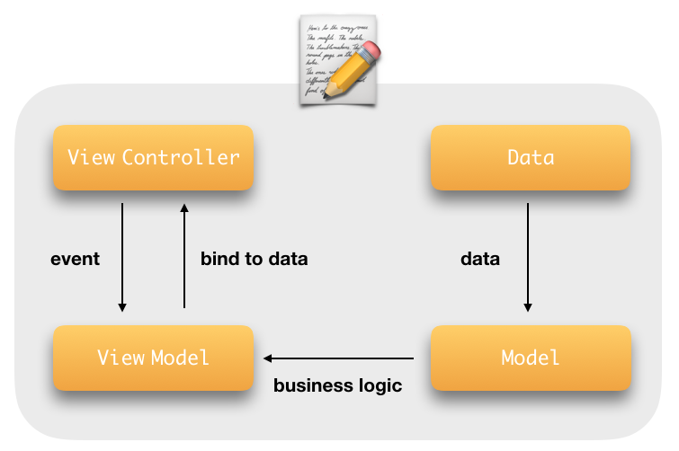

# Memo
📝 이미지 첨부 기능을 가진 메모장 어플리케이션

##  Contents
- Feature
- Design
- Implementation
- Git Management
- Style Guide

##  Feature
- 📝 Memo List 
- 👀 Detail of Memo
- ✏️ Edit and Write a Memo

<br>

<p align="center">&nbsp;&nbsp;&nbsp;&nbsp;&nbsp;&nbsp;&nbsp;&nbsp;&nbsp;&nbsp;&nbsp;&nbsp;&nbsp;&nbsp;&nbsp;&nbsp;</p>

<br>

## Design
MVVM Desgin Pattern을 사용하였다.
<p align="center"></p>

<br>

## Implementation

| **구분**                | **역할**                                                     |
| :---------------------- | :----------------------------------------------------------- |
| **Common Components**   |                                                              |
| ViewController          | UIViewController에 bind하기 위한 공통 ViewController         |
| MToolbar                | 공통  Custom Toolbar                                         |
| **Views**               |                                                              |
| IndexViewController     | viewModel에서 메모 리스트를 받아 table로 뿌려준다.           |
| IndexViewModel          | view로 memo list data를 binding 해준다.                      |
| IndexModel              | 메모 리스트의 비즈니스 로직을 처리하는 부분.                 |
| EditViewController      | 메모를 작성 혹은 수정하여 ViewModel에게 전달한다.            |
| EditViewModel           | Data 저장소로 data를 binding 해준다.                         |
| EditModel               | Data 수정 및 저장 비즈니스 로직을 처리하는 부분.             |
| DetailViewController    | viewModel에서 메모 상세 정보를 받아 뿌려준다.                |
| DetailViewModel         | view로 detail data를 binding 해준다.                         |
| DetailModel             | 메모 상세 정보의 비즈니스 로직을 처리하는 부분.              |
| **Components**          |                                                              |
| MemoListCell            | Index view의 tableView cell                                  |
| **Models**              |                                                              |
| Memo                    | Memo data의 모델                                             |
| **Constans**            |                                                              |
| Constants               | App의 각종 상수                                              |
| Enums                   | App의 각종 enum                                              |
| **DataManager**         |                                                              |
| UserDefaultsManager     | UserDefault Data를 생성, 업데이트, 삭제, 가져오기 하는 Protocol |
| UserDefaultsManagerImpl | UserDefaultsManager 구현                                     |
| ImageManager            | 로컬 이미지를 저장 및 로드하는 protocol                      |
| ImageManagerImpl        | ImageManager의 구현                                          |
| **Extension**           |                                                              |
| UITextView+Utils        | text 입력 시마다 height를 계산하는 extesion                  |
| UIViewController+Utils  | ViewController에 Utils 성 메서드를 추가하기 위한 extension   |
| UIViewController+UI     | ViewController에 UI를 추가하는 extension                     |

<br>

## Git Management

- master : 개발 및 최종본

**Commit Message 양식은 아래의 규칙을 따른다.**  

```
1줄 : 
[커밋 코드] 구현 및 수정 내용

1줄 이상 : 
[커밋 코드] 구현 및 수정 내용 간략히
- 구현 내용 1
- 구현 내용 2

| COM | 공통적으로 구현한 코드 |
| IND | INDEX 화면 관련 코드 |
| DET | DETAIL 화면 관련 코드 |
| EDI | EDIT 화면 관련 코드 |
```
<br>

## Style Guide

- Swift Dev Version : 5
- Deployment Target : 10.0
- Device Target : iPhone
- Code Architecture : MVVM
